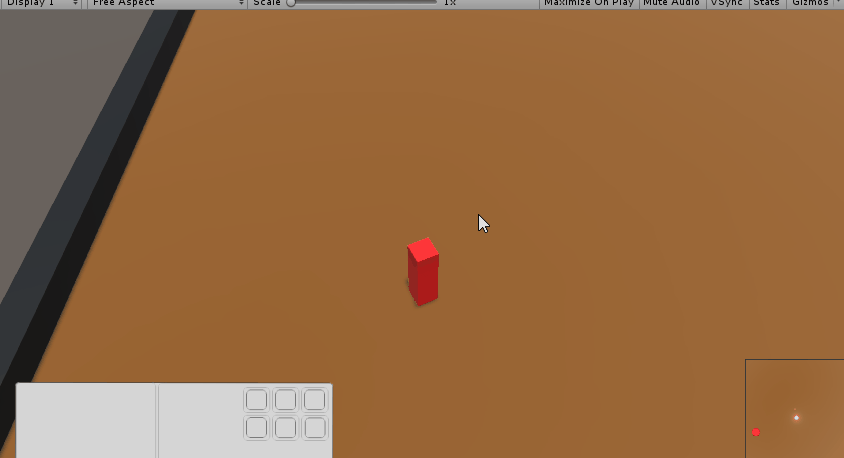
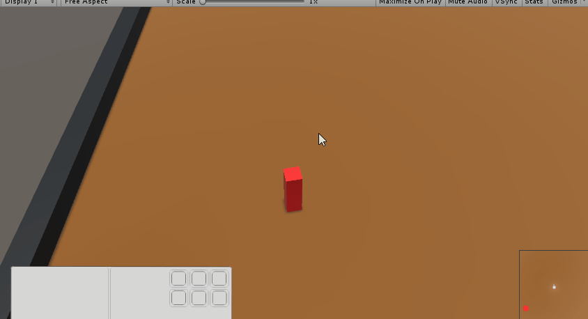
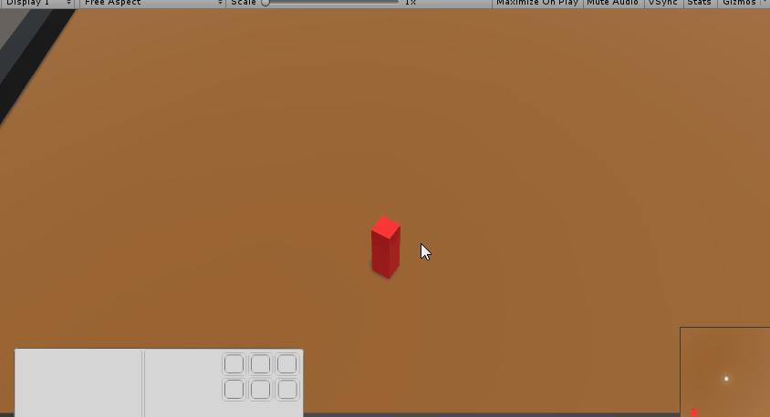
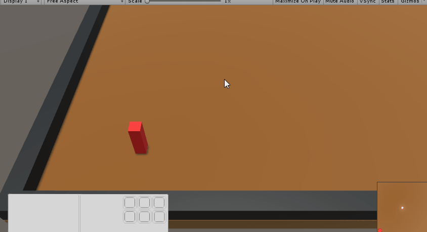
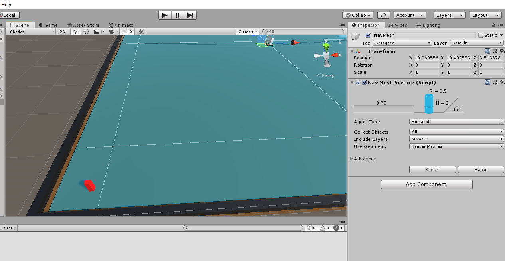

# MobaCam-Movement

I tried recreate a league of legend like camera and deplacement system in unity.

I used C# and Unity3D Environnement

#1.Camera system

I needed to make a lockable/unlockable camera which focus on the player object.

The camera also needed the ability to zoom/dezoom and keep a constant recoil.

It needed to remember its recoil when the locked camera was blocked by the map's edge to keep the player in the center of the screen when leaving the edge of the map.

#2.Movement system

I wanted to make the player movable by right-clicking on the location we wanted to move to.

I used a navmesh to determine which surface was walkable

